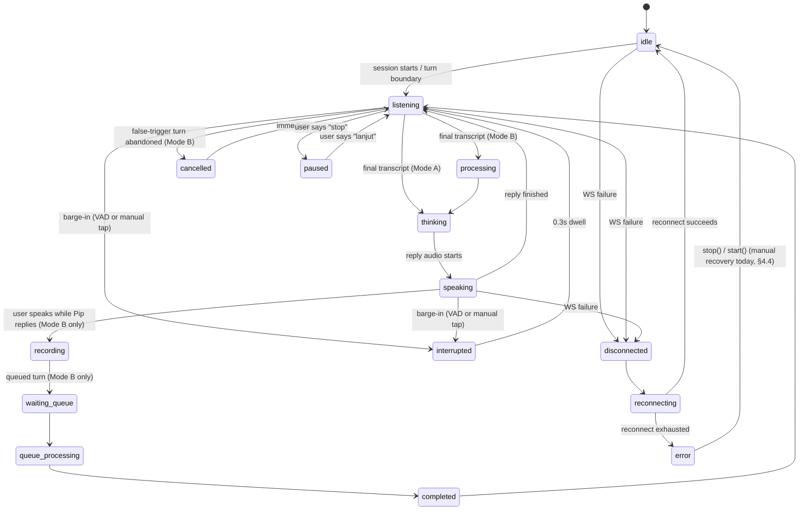
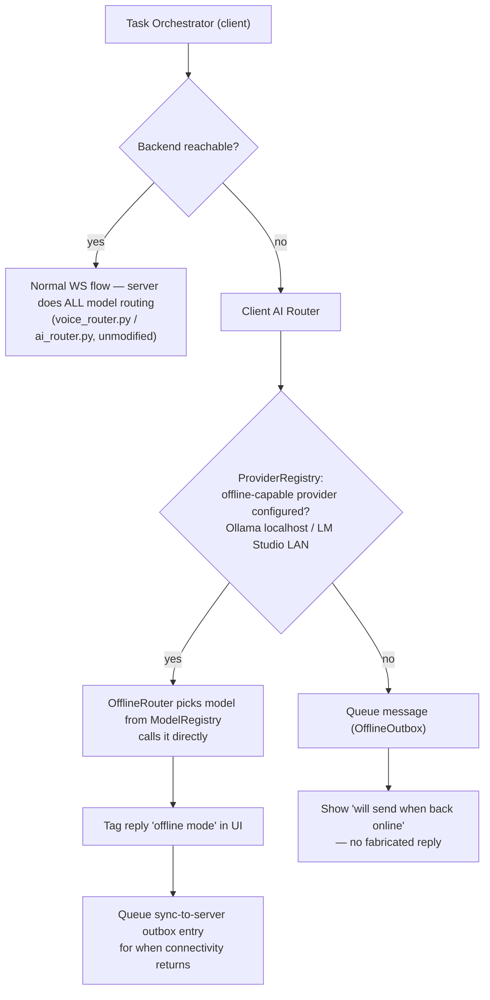
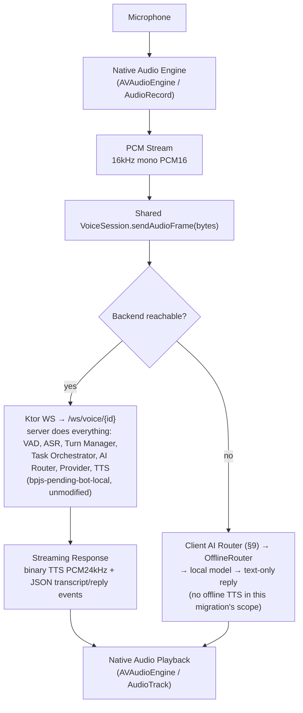
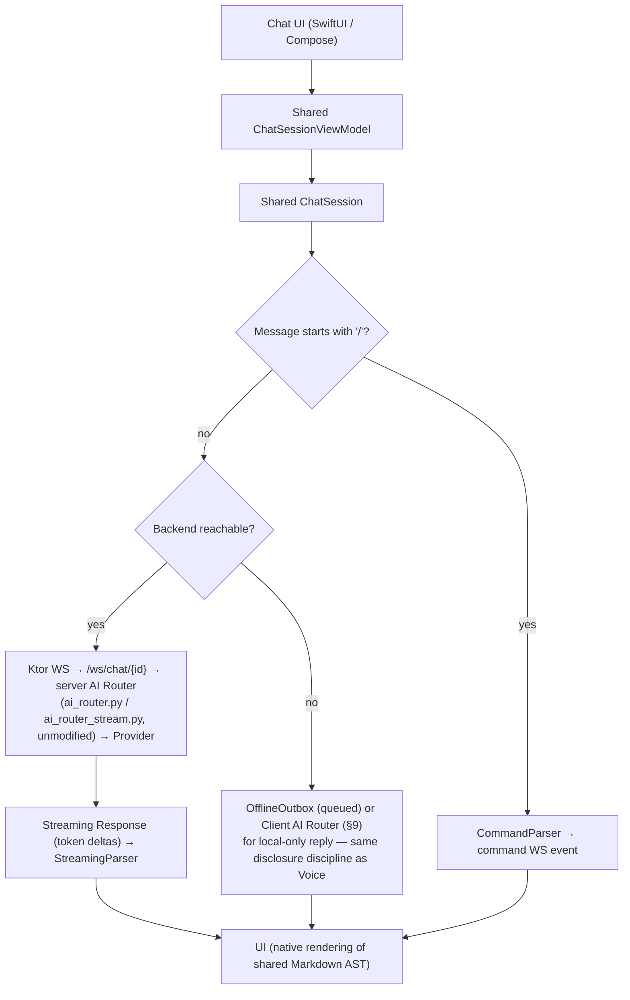
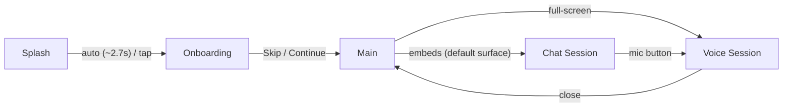

# PRD/TDD – Migrasi Voice & Chat ke Kotlin Multiplatform (KMP)

## Document Control

| | |
|---|---|
| Version | 2.1 (supersedes 2.0) |
| Status | Ready for Review |
| Product | Pip Voice AI Assistant |
| Owner | Mobile Team |
| Stakeholders | Product Manager, iOS Team, Android Team, Backend Team, AI Team, QA Team |

### What changed from v2.0

v2.0's content was already complete and audit-grounded; nothing in it was
wrong or re-scoped. This revision closes two gaps found on re-check against
the original request:

1. **Diagrams.** v2.0's diagrams were plain ASCII text boxes. This revision
   adds real Mermaid diagrams alongside them (kept, not replaced, since the
   ASCII versions render fine in a plain-text diff/terminal) for: the
   layered shared-module architecture (§5), the AI Router decision flow
   (§9), the Voice and Chat pipelines (§10/§11), a `VoiceTurnState` state
   diagram (§7.1, new), and the Android/iOS navigation flow (§13a).
2. **Chat command handling.** §8 listed streaming, typing state, markdown,
   retry, cache, and conversation management, but never called out the
   `/start` / `/model gemini`-style slash-command path (real in
   `KeyboardSessionView.send()` today, and the `command` WS event
   `ChatSocketClient` already dispatches) as its own component. §8 now
   names it explicitly (`CommandParser`).

### What changed from v1.0

v1.0 stated intent and a high-level phase list but wasn't grounded against
the actual iOS codebase or the actual backend, so several of its
assumptions don't hold once checked against what's really built. This
revision keeps every original section, every original goal, and the
original phase numbering — it does not rewrite the vision — but corrects
it against reality in three places, and fills in everything v1.0 left as
a heading with no content (Phase 0, NFRs, Testing Strategy, Android UI,
detailed module structure):

1. **The current iOS app is a thin client**, not a fat one. A full
   read-only audit of `pipvoice/Pip` (§4) found no on-device AI Router,
   Conversation Manager, Task Orchestrator, or Memory layer — those
   already exist, fully implemented, server-side (`bpjs-pending-bot-local`,
   Python). §5a is new: it defines precisely what "AI Router" and "Memory"
   mean as *client-side KMP modules* so Sprint 3/Phase 5's deliverable is
   real code with a real job, not a duplicate of server logic with nothing
   to do.
2. **This workspace already has a KMP architecture prototype** —
   `pipvoice/ARCHITECTURE.md` + `pipvoice/index.html`, a working browser
   simulation of a StateFlow/MVVM/UseCase/Repository shared-module design.
   It assumes a richer screen set (Home/Search/Profile/Settings, tabbed)
   than the real iOS app has today. This revision keeps that prototype's
   *architecture pattern* (it's sound and this doc adopts it as the
   baseline in §5/§12) but scopes v1 migration to the screens that
   **actually exist** in iOS today, and files the prototype's extra
   screens as an explicit Phase N+1 roadmap item (§19) so that design
   work isn't lost, just sequenced correctly.
3. Backend is confirmed **out of scope, unmodified** for this migration —
   every "shared" module described below is a client-side concern only.

---

# 1. Background

**Pip Voice AI Assistant** currently has an iOS app built with:

- SwiftUI
- MVVM (loosely — see §4.3, most screens hold state directly rather than
  through a dedicated screen ViewModel)
- Repository pattern (present but thin — one `Repository`/`BaseRepository`
  pair, mostly unused; real screens talk to WebSocket clients directly)
- Combine / Swift Concurrency
- Native Navigation (manual `@State` view-swapping today, not
  `NavigationStack` — see §4.7)
- Native Audio (`AVAudioEngine`, full duplex mic capture + streamed TTS
  playback)

Android has **no app at all today** — not "developed separately," as v1.0
stated, but genuinely nonexistent. This is the first Android build.

Voice AI and Chat AI will keep growing, and both platforms will need the
same networking contract, the same reconnect/retry behavior, and the same
state-machine semantics for voice turn-taking. Building that twice (once
per platform) is the duplication this migration exists to prevent —
**not** duplication of AI logic, which was never on-device to begin with.

---

# 2. Objective

Migrate incrementally to Kotlin Multiplatform without rewriting the iOS
app's UI.

Primary targets:

- Keep native iOS UI (SwiftUI) — unchanged.
- Build native Android UI (Jetpack Compose) — **does not exist yet**;
  design it to match the current iOS implementation's screens and flow as
  closely as possible (§13a), not the richer prototype in `index.html`.
- Share 100% of the networking, session/state-machine, and data-model
  layer between the two platforms.
- Eliminate the *class* of duplication that would otherwise happen when
  Android is built from scratch against the same WS/REST contract iOS
  already implements.
- Ship AI feature velocity improvements by having exactly one client-side
  implementation of "how do I talk to the voice/chat backend and hold its
  state," instead of two.

---

# 3. Scope

## In Scope

- Voice AI (client-side session/state-machine layer only — see §5a)
- Chat AI (client-side session/state-machine layer only — see §5a)
- Client-side AI Router / Provider Registry / Model Registry (§9) — a
  **new** capability, not a migration of existing logic: local-fallback
  routing for offline mode (Ollama/LM Studio on-device or on-LAN), not a
  competitor to the server's routing.
- Conversation Manager (client-side: turn/thread state, optimistic UI,
  retry — §7)
- Memory (client-side: short-lived conversation cache + offline queue,
  distinct from the server's long-term memory — §5a, §7)
- Repository / Use Case layers (client-side data access abstraction)
- Networking: REST client, WebSocket client (voice + chat)
- Models / DTOs
- Cache (conversation cache, settings cache — local only)
- Configuration (build-time + remote feature flags)
- Analytics (client-side event emission — the client already reports into
  `pip-voice-ai-dashboard`'s event contract; this becomes a shared,
  typed emitter instead of ad hoc calls)
- **New**: Android UI (Compose), matching current iOS screens/flow (§13a)

## Out of Scope

- Rewriting SwiftUI
- Rewriting/inventing new Android UI beyond what iOS already has (that's
  Phase N+1, §19 — this migration is not the vehicle for shipping
  Search/Profile/Settings/Auth, which don't exist on either platform yet)
- Native Navigation frameworks (`NavigationStack`, Compose Navigation) —
  each platform keeps its own native navigation idiom; only the
  *decisions* (what state implies what screen) are shared, via the
  UseCase/ViewModel layer, not the navigation APIs themselves
- Native Audio Engine (`AVAudioEngine` / `AudioRecord`+`AudioTrack`) — PCM
  in/out crosses the KMP boundary as raw bytes/callbacks; the engines
  themselves stay 100% native per platform
- Native Animation (the blob mascot's Shape/Canvas drawing code)
- **Any backend change.** `bpjs-pending-bot-local` is not touched by this
  migration. Every "AI Router"/"Memory"/"Conversation Manager" module
  described below is new client-side code with a client-side job — see §5a.

---

# 4. Existing Architecture (iOS) — audited, not assumed

Full source: `pipvoice/Pip/Pip/`. Confirmed via direct read of every file
(not sampled) — the sections below are what's actually there today.

## 4.1 Layer reality

```text
SwiftUI View  (mostly holds @State directly, not delegated to a VM)
   │
   ├── VoiceSessionView / KeyboardSessionView  ← own their WS client directly
   │
   ▼
WS Client (VoiceSocketClient / ChatSocketClient)  ← the real "data layer" today
   │
   ▼
URLSessionWebSocketTask  /  Alamofire (APIClient, 3 REST endpoints)
   │
   ▼
Backend (bpjs-pending-bot-local, port 8000)
```

This is flatter than the PRD's original §4 diagram implies — there is no
`UseCase` layer in the current app (`Repository.swift`/`BaseRepository`
exist but back only the confirmed-unused `Posts` demo feature), and only
`VoiceSessionView`/`KeyboardSessionView` have anything resembling a screen
ViewModel, and even those hold most state as plain `@State`, not in an
`ObservableObject`. **This is exactly the gap KMP's UseCase/Repository/
ViewModel layering (§5, adopted from the existing `ARCHITECTURE.md`
prototype) is meant to fill** — the migration isn't porting an existing
layer, it's introducing the layer that's missing today, in a way both
platforms can share from day one.

## 4.2 Screens (all of them — confirmed complete, nothing else reachable)

| Screen | File | Real today |
|---|---|---|
| Splash | `Features/Splash/SplashView.swift` | Branded launch screen, auto-advances ~2.7s or on tap |
| Onboarding | `Features/Onboarding/OnboardingView.swift` | One card ("Hi, I'm Pip"), Skip/Continue both go to Main — no mic-permission step, no multi-page carousel (unlike the `index.html` prototype's richer 3-page onboarding) |
| Main | `Features/Main/MainView.swift` | Thin host — embeds `KeyboardSessionView` inline as the default surface; owns `fullScreenCover` presentation for both Voice and Chat sessions. A segmented voice/chat chooser exists as **dead, commented-out code** |
| Voice Session | `Features/Main/VoiceSessionView.swift` | Full-screen sheet: mic capture, streamed TTS playback, animated mascot reflecting server-driven state (idle/listening/thinking/speaking/interrupted/paused/queued — 15 states total server-side), listening-mode picker, Mode A/B picker (dev-facing), thumbs up/down feedback |
| Chat Session | `Features/Main/KeyboardSessionView.swift` | Full-screen sheet: Telegram-style bubbles, swipe-to-reply, markdown+link rendering, streaming token display, date separators, history restore on open, mic button to jump into voice |
| Posts (demo) | `Features/Posts/*` | **Confirmed unused boilerplate** — unreachable from any real navigation path. Not migrated, not deleted (not this migration's call to make). |

No Home/Search/Profile/Settings/Auth screens exist. `index.html`'s richer
model (tabs, conversation list, search, profile, settings) is a forward
design, not current product — see §19.

## 4.3 ViewModels / state owners

| Class | Real state | Talks to |
|---|---|---|
| `VoiceSocketClient` | `serverState`, `queueLength`, `lastRttMs`, `isTalking`, `isSpeaking`, `audioLevel`, `micLevel` | WS `/ws/voice/{id}`; drives `AVAudioEngine` directly |
| `ChatSocketClient` | `isConnected` | WS `/ws/chat/{id}` |
| `PipAvatarViewModel` | 5-state avatar model (idle/listening/thinking/speaking/interrupted) | Subscribes to `VoiceSocketClient`'s levels; owns `BlinkScheduler` |
| `BuddyStore` | `selected: Buddy` (in-memory, not persisted) | Nothing — pure local UI state |
| `BaseViewModel`/`PostsViewModel` | demo only | unused feature |

No dedicated `SplashViewModel`/`OnboardingViewModel`/`MainViewModel` exist
— that logic lives inline in the Views today (`ContentView`'s hand-rolled
`AppStage` enum). KMP migration is a genuine opportunity to introduce
these cleanly, matching the shape `ARCHITECTURE.md` already specced.

## 4.4 Networking surface (the real contract)

**Base URL**: `AppEnvironment.swift` — both `.development`/`.production`
hardcode `http://localhost:8000` today (no environment-plist, no remote
config). `wsBaseURL` derives `ws://`/`wss://` by string substitution.

**WebSocket:**
- `WS /ws/voice/{session_id}` — binary PCM16 mono, 16kHz mic-up / 24kHz
  TTS-down. JSON events in: `transcript`, `reply`, `queue_update`,
  `interrupt`, `error`, `notice`, `state`, `pong`, `reply_audio_start`.
  JSON events out: `stop`, `push_to_talk_start`/`push_to_talk_end`,
  `feedback`, `ping`.
- `WS /ws/chat/{session_id}` — JSON events: `thinking`, `typing`, `done`,
  `command`, `error`, `notice`.

**REST:**
- `GET /api/session/{id}/history`
- `PUT /api/session/{id}/listen?mode=responsive|patient|ptt`
- `PUT /api/session/{id}/voice_mode?mode=a|b`

No auth endpoints exist (`AuthTokenStore` is dead scaffolding — a Bearer
header is wired but never set).

## 4.5 Local persistence

`UserDefaults` only — a per-install session UUID (`AppSession`) and an
unused auth token. No Core Data, SwiftData, Keychain, or SQLite. Chat
history is never cached locally; it's re-fetched from the REST endpoint
every time the chat sheet opens.

## 4.6 Third-party dependencies

Exactly one: **Alamofire** 5.12.0 (SPM), used only in `Core/Networking/`'s
REST layer. WebSockets/audio/reactive state are all first-party Apple
frameworks. This matters directly for §5's tooling choice: Alamofire is
iOS-only and cannot live in `commonMain` — it's replaced, not ported.

## 4.7 Navigation

Hand-rolled `@State` enum view-swapping in `ContentView.swift` (not
`NavigationStack`). Voice/Chat sessions are `.fullScreenCover` sheets, not
pushed routes. No deep-linking, no URL/route model, no persisted
"onboarding seen" flag (always restarts at Splash on relaunch — worth
fixing as a side effect of this migration, see §16).

## 4.8 Existing Android state

None. No project, no module, no code. This PRD is also that project's
starting spec.

---

# 5. Target Architecture

Adopts the layering already prototyped in `pipvoice/ARCHITECTURE.md` (a
StateFlow/MVVM/UseCase/Repository design, validated in the browser
simulation at `pipvoice/index.html`) as the production baseline, scoped to
the screens that actually exist (§4.2) plus the sessions/state machines
that actually exist (§4.4), not the prototype's fuller screen set.

```text
                         Shared KMP Module ("shared")
════════════════════════════════════════════════════════════════════════
 Presentation-facing          Domain                    Data
 ─────────────────           ──────                    ────
 ViewModel (StateFlow)  ◄──  UseCase          ◄──  Repository
   SplashViewModel            SendChatMessage       ChatRepository
   OnboardingViewModel        StartVoiceSession      VoiceRepository
   MainViewModel              StopVoiceSession        SessionRepository
   VoiceSessionViewModel      SendAudioFrame          SettingsRepository
   ChatSessionViewModel       GetChatHistory
                              SetListeningMode
                              SetVoiceMode
                              SubmitFeedback
════════════════════════════════════════════════════════════════════════
 AI (client-side only — see §5a)      Voice                  Chat
 ────────────────────────────────     ─────                  ────
 ProviderRegistry (offline routes)     VoiceSession            ChatSession
 ModelRegistry (local model catalog)   VoiceTurnState           StreamingParser
 OfflineRouter (Ollama/LM Studio)      ReconnectPolicy          TypingState
════════════════════════════════════════════════════════════════════════
 Network                              Memory                 Analytics
 ───────                              ──────                 ─────────
 KtorHttpClient                        ConversationCache       AnalyticsEmitter
 KtorWebSocketClient                   OfflineOutbox            EventQueue
 ReconnectingSocket
════════════════════════════════════════════════════════════════════════
 Core
 ────
 Logger · Config · FeatureFlags · Result/Error types · DI (Koin)
════════════════════════════════════════════════════════════════════════
        ▲                                              ▲
        │                                              │
  iOS (SwiftUI)                                Android (Compose)
        │                                              │
  Native ViewModel bridge                     Native ViewModel bridge
  (StateFlow → Combine/                       (collectAsStateWithLifecycle,
   async-await via SKIE)                        StateFlow is idiomatic Kotlin)
        │                                              │
  AVAudioEngine (native)                       AudioRecord/AudioTrack (native)
```

Same layering, as a Mermaid diagram:

```mermaid
flowchart TB
    subgraph iosNative["iOS — Native"]
        iosVM["Native ViewModel bridge (SKIE: StateFlow to Combine/async-await)"]
        iosAudio["AVAudioEngine"]
    end
    subgraph androidNative["Android — Native"]
        androidVM["Native ViewModel bridge (collectAsStateWithLifecycle)"]
        androidAudio["AudioRecord / AudioTrack"]
    end

    subgraph shared["Shared KMP Module (\"shared\")"]
        subgraph presentation["Presentation-facing"]
            VM["ViewModel (StateFlow)<br/>Splash / Onboarding / Main /<br/>VoiceSession / ChatSession"]
        end
        subgraph domain["Domain"]
            UC["UseCase<br/>SendChatMessage, StartVoiceSession,<br/>StopVoiceSession, SendAudioFrame,<br/>GetChatHistory, SetListeningMode,<br/>SetVoiceMode, SubmitFeedback"]
        end
        subgraph data["Data"]
            Repo["Repository<br/>Chat / Voice / Session / Settings"]
        end
        subgraph ai["AI (client-side only, §5a)"]
            AIRouter["ProviderRegistry · ModelRegistry · OfflineRouter"]
        end
        subgraph voice["Voice"]
            VoiceMod["VoiceSession · VoiceTurnState · ReconnectPolicy"]
        end
        subgraph chat["Chat"]
            ChatMod["ChatSession · StreamingParser · TypingState · CommandParser"]
        end
        subgraph network["Network"]
            Net["KtorHttpClient · KtorWebSocketClient · ReconnectingSocket"]
        end
        subgraph memory["Memory"]
            Mem["ConversationCache · OfflineOutbox"]
        end
        subgraph analytics["Analytics"]
            Analytics["AnalyticsEmitter · EventQueue"]
        end
        subgraph core["Core"]
            Core["Logger · Config · FeatureFlags · Result/Error · DI (Koin)"]
        end

        VM --> UC --> Repo
        Repo --> voice
        Repo --> chat
        Repo --> network
        voice --> ai
        chat --> ai
        voice --> memory
        chat --> memory
        VM -.-> analytics
        presentation -.-> core
        domain -.-> core
        data -.-> core
    end

    iosVM <--> presentation
    androidVM <--> presentation
    iosAudio <-. "PCM in/out, no KMP crossing of audio I/O itself" .-> VoiceMod
    androidAudio <-. "PCM in/out, no KMP crossing of audio I/O itself" .-> VoiceMod
```

## 5a. Where does "AI Router" / "Memory" / "Conversation Manager" actually run?

This is the section v1.0 needed and didn't have. Read literally, v1.0's
Phase 5/6/§9 implies porting an on-device AI Router and Memory system into
KMP. **There is nothing to port** — confirmed by §4's audit, every one of
those concepts is fully implemented server-side already
(`voice_router.py`'s provider-chain-with-fallback + dashboard-editable
`intent_config` overrides; `ai_router.py`/`ai_router_stream.py` for chat;
`memory.py`/`session_store.py` for long-term memory; the whole
Conversation Queue Management system in `mode_b_pipeline.py`). Duplicating
that client-side would create two sources of truth for the same decision
— a bug generator, not a feature.

So this migration defines these modules with a **client-side job that's
real and doesn't exist anywhere yet**, not a copy of server logic:

| Module | Server already does this | Client-side job (new, real) |
|---|---|---|
| **AI Router** (client) | Chooses cloud/local provider per-turn, with fallback chains, per §9 of `voice_router.py` | Chooses whether a turn goes to the **server at all**, or to a **local/offline provider** (Ollama/LM Studio reachable on localhost/LAN — §21) when the server is unreachable. A genuinely new capability, not a duplicate. |
| **Provider Registry / Model Registry** | Lives in `voice_routes.yaml` + dashboard `intent_config` table | A small local catalog of *offline-capable* providers/models only (what's reachable without the backend) — feeds the client AI Router above. |
| **Conversation Manager** | Turn-taking, queueing (`conversation_queue.py`), state machine (`voice_state_machine.py`, 15 states) | Mirrors the server's `VoiceState` enum client-side (already partially done in iOS's `ServerState`, per this session's earlier iOS work) so UI has one authoritative state representation, shared between platforms. Owns optimistic local UI state (e.g. an outgoing chat bubble shown before the server ACKs) and reconciles it against server events. |
| **Memory Manager** | Long-term cross-session memory (`memory.py`, Postgres-backed) | A **short-lived, local-only** cache: conversation scrollback for instant screen-open (no more re-fetching history from REST every time, per §4.5's gap), plus an offline outbox for messages sent while disconnected. Explicitly not a copy of server memory — different data, different lifetime, different purpose. |
| **Streaming Pipeline** | Token/audio streaming assembly server-side | Client-side stream *consumption*: assembling streamed WS tokens into renderable text (already exists ad hoc in `KeyboardSessionView`'s `model_buffer`/`user_buffer` pattern — becomes a shared `StreamingParser`), and PCM chunk buffering for playback. |

Net effect: §7-§9 below describe these as **client session/state/
routing modules**, explicitly not reimplementations of `voice_router.py`/
`memory.py`/`mode_b_pipeline.py`. Anyone implementing this should treat a
PR that duplicates server decision logic client-side as a scope bug, not
a feature.

## 5.2 Module boundaries & package structure

Single Gradle multiplatform module (`shared`) to start — split into
multiple Gradle modules only if build times or team ownership boundaries
demand it later (premature multi-module KMP setup is a common source of
Gradle config overhead with no payoff at this project's size).

```text
shared/
  build.gradle.kts
  src/
    commonMain/kotlin/com/pip/shared/
      core/
        logger/           Logger (expect/actual: os_log vs Logcat)
        config/           AppConfig (base URL, build variant)
        featureflag/       FeatureFlagProvider (local + remote-overridable)
        result/            Result<T>/PipError sealed hierarchy
        di/                Koin modules (sharedModule, platformModule expect)
      network/
        http/              KtorHttpClient, ApiEndpoint, ApiError, ApiResponse<T>
        ws/                ReconnectingWebSocketClient (shared connect/backoff/dispatch core)
        dto/               Wire-format DTOs (kotlinx.serialization)
      domain/
        model/             Domain models (Conversation, Message, VoiceState, SessionId)
        usecase/           SendChatMessage, StartVoiceSession, StopVoiceSession,
                            SendAudioFrame, GetChatHistory, SetListeningMode,
                            SetVoiceMode, SubmitFeedback
      data/
        repository/        ChatRepository, VoiceRepository, SessionRepository,
                            SettingsRepository (impl, backed by network/ + memory/)
      ai/
        ProviderRegistry.kt      offline-capable providers only (see §5a)
        ModelRegistry.kt
        OfflineRouter.kt
      voice/
        VoiceSession.kt          Ktor WS session + JSON dispatch + reconnect (NOT audio I/O)
        VoiceTurnState.kt        mirrors server VoiceState (15 states)
      chat/
        ChatSession.kt           Ktor WS session + JSON dispatch + reconnect
        StreamingParser.kt       token-stream → renderable text assembly
        MarkdownModel.kt         parsed markdown AST (native layer renders it)
      memory/
        ConversationCache.kt     local scrollback cache (in-memory + optional SQLDelight)
        OfflineOutbox.kt         queued-while-disconnected messages
      analytics/
        AnalyticsEmitter.kt      typed event emission → existing dashboard event contract
      viewmodel/
        SplashViewModel.kt
        OnboardingViewModel.kt
        MainViewModel.kt
        VoiceSessionViewModel.kt
        ChatSessionViewModel.kt
    iosMain/kotlin/com/pip/shared/
      core/logger/            NSLog-backed actual
      core/di/                platformModule actual (iOS-specific bindings)
      network/ws/             Ktor Darwin engine wiring
    androidMain/kotlin/com/pip/shared/
      core/logger/            Logcat-backed actual
      core/di/                platformModule actual (Android-specific bindings)
      network/ws/             Ktor OkHttp engine wiring
    commonTest/ / iosTest/ / androidUnitTest/
      (see §17 Testing Strategy)
```

## 5.3 Tooling decisions (defaults — flag if a team objects)

- **Ktor** (HTTP + WebSocket, multiplatform) replaces Alamofire. Darwin
  engine on iOS, OkHttp engine on Android.
- **kotlinx.serialization** for all wire-format DTOs.
- **kotlinx.coroutines** + `StateFlow` for reactive state — matches the
  pattern already prototyped in `ARCHITECTURE.md`.
- **SKIE** (Touchlab) for Swift interop — turns Kotlin `suspend`
  functions into real `async`/`await` and `Flow`/`StateFlow` into
  `AsyncSequence`/idiomatic Combine publishers on the Swift side, so
  `VoiceSessionView`'s existing `@Published`-consumption code needs
  minimal reshaping. (v1's original risk note "Integrasi StateFlow dengan
  SwiftUI" is exactly what SKIE exists to solve — recommending a named
  tool closes that risk instead of leaving it open.)
- **Koin** for DI (multiplatform-native, no codegen step, lighter setup
  than Dagger/Hilt-for-KMP).
- **SQLDelight** (optional, only if `ConversationCache`/`OfflineOutbox`
  need to survive app kill, not just backgrounding) — start with an
  in-memory cache; promote to SQLDelight only if product requires
  surviving a full app restart. Don't build persistence the feature
  doesn't need yet.
- **XCFramework + local SPM package + Xcode Run Script build phase**
  (`embedAndSignAppleFrameworkForXcode`) for iOS integration — not
  CocoaPods (no Podfile exists today).

---

# 6. Migration Strategy

### Phase 0 — Project Setup, CI/CD, Build Configuration (new)

- New repo/directory: `pipvoice/PipShared/` — Gradle multiplatform
  project, `shared` module, targets `iosArm64`/`iosSimulatorArm64` +
  `androidTarget` declared from day one (even before the Android app UI
  exists — costs nothing to declare, saves a rework later).
- Gradle version catalog (`libs.versions.toml`) pinning Kotlin, Ktor,
  kotlinx.serialization, kotlinx.coroutines, Koin, SKIE plugin versions.
- CI: a GitHub Actions (or equivalent) job matrix running
  `./gradlew :shared:build :shared:test` on every PR, plus a separate iOS
  job doing `xcodebuild build` for the Pip scheme once Phase 5 lands the
  Xcode integration — catches a Kotlin-side break before it reaches
  Xcode, and an Xcode-integration break before it reaches either app.
- Coding convention: `ktlint` or `detekt` for Kotlin (pick one, both are
  standard KMP choices — team preference, not an architectural one),
  SwiftLint stays as-is for the existing iOS Swift code (unaffected by
  this migration).
- Local dev loop documented: `./gradlew :shared:build` standalone (no
  Xcode needed) for Phases 1-4; only Phase 5 needs Xcode in the loop.

### Phase 1 — Shared Domain

Models, DTOs, Mappers (§5.2's `domain/model/` + `network/dto/`) — see §5a
for what's genuinely new vs. what's a straight port of the WS/REST shapes
already documented in §4.4.

### Phase 2 — Networking

API Client (Ktor), WebSocket client (Ktor, shared reconnect/backoff core
used by both `VoiceSession` and `ChatSession`), Authentication (currently
dead scaffolding — port the shape, don't invent a login flow that doesn't
exist), Retry, Refresh Token (same caveat — no refresh-token flow exists
today; this slot stays a documented no-op until a real auth system ships).

### Phase 3 — Repository

Chat Repository, Voice Repository, Settings Repository (new — no Settings
screen exists yet, but the REST-backed listening-mode/voice-mode calls are
effectively settings today), Session Repository (`AppSession`'s UUID
management, moved to `commonMain` via `expect`/`actual`).

### Phase 4 — Use Case

Send Chat, Send Voice (audio frame relay), Start Voice Session, Stop Voice
Session, Retry, Load History, Set Listening Mode, Set Voice Mode, Submit
Feedback — one UseCase per real user action identified in §4.

### Phase 5 — AI Layer (redefined — see §5a)

Client-side AI Router / Provider Registry / Task Orchestrator /
Conversation Manager / Prompt Builder, scoped to **offline/local routing
and turn-state management**, not a duplicate of the server's router.
Prompt Builder here means: assembling the *client-side* system context
(e.g. offline-mode disclaimer text) when routing locally, not the
server's actual prompt construction (`ai_router.py`'s system prompts stay
server-side, untouched).

### Phase 6 — Memory (redefined — see §5a)

Conversation Memory (local scrollback cache), Summary Memory (deferred —
no client-side summarization capability exists or is scoped here; this
slot stays a documented placeholder, not a stub that pretends to work).

### Phase 7 — Analytics

Voice Analytics, Chat Analytics, AI Analytics — a typed
`AnalyticsEmitter` wrapping the event shapes `pip-voice-ai-dashboard`
already accepts (`analytics_events.py`'s contract, server-side, unchanged)
so both platforms emit identically-shaped events instead of each
hand-rolling its own.

---

# 7. Voice Feature

## Shared (KMP)

- **VoiceSession** — Ktor WebSocket session to `/ws/voice/{id}`: connect,
  reconnect/backoff, JSON event parse + dispatch. Explicitly **not**
  audio I/O — see Native below.
- **VoiceTurnState** — mirrors the server's 15-state `VoiceState` enum
  (idle/listening/recording/processing/thinking/speaking/interrupted/
  paused/waiting_queue/queue_processing/completed/cancelled/error/
  disconnected/reconnecting) as a Kotlin sealed class, exposed as
  `StateFlow<VoiceTurnState>`.
- **Client AI Router** (§5a) — offline-only routing decision, not
  server-router duplication.
- **Task Orchestrator** (client) — decides, on each turn, "send to
  server" vs. "route offline" vs. "queue for when reconnected" — the
  client-side counterpart to §5a's table, not the server's task
  classification.
- **Conversation Manager** (client) — turn history, optimistic local
  state, reconciliation against server events.
- **VoiceSessionViewModel** — the missing screen ViewModel identified in
  §4.3, composing the above into `VoiceSessionUiState` for both
  platforms' UI layer.
- **Voice Analytics** — typed event emission (§7 Phase 7).

## 7.1 VoiceTurnState (new — Mermaid)

Transitions below are **inferred from the client-observed comments in
`VoiceSocketClient.swift`** (e.g. the 0.3s `interrupted → listening` dwell,
`cancelled` being transient-then-`listening`, Mode B's queue states) — not
a formal spec pulled from the server's `voice_state_machine.py`. Treat this
as the best current client-side model to mirror in `VoiceTurnState`;
confirm the exhaustive transition table with Backend before Sprint 4 codes
against it (an open item worth adding to §22's open-questions list, not
resolved by guesswork here).



## Native

### iOS
- `AVAudioEngine`, `AVAudioSession` — mic capture (16kHz PCM16) + TTS
  playback (24kHz float32), exactly as today.
- Bluetooth routing (`AVAudioSession` category/options — already
  `.playAndRecord`/`.voiceChat`/`.allowBluetooth` today).
- Microphone permission (`AVAudioApplication.requestRecordPermission`).

### Android (new)
- `AudioRecord` (mic capture, matching sample rate/format) + `AudioTrack`
  (TTS playback).
- `MediaSession` (for lock-screen/notification playback controls, if in
  scope — flagged as a product decision, not assumed).
- Bluetooth routing via `AudioManager`/`AudioDeviceInfo`.
- `RECORD_AUDIO` runtime permission.

---

# 8. Chat Feature

## Shared

- **ChatSession** — Ktor WS session to `/ws/chat/{id}`: connect,
  reconnect, JSON event dispatch (`thinking`/`typing`/`done`/`command`/
  `error`/`notice`).
- **StreamingParser** — assembles streamed `typing` token deltas into
  renderable text (ports `KeyboardSessionView`'s existing
  `model_buffer`/`user_buffer` accumulation pattern into shared code).
- **Typing State** — `isAiTyping`-equivalent, `StateFlow<Boolean>`.
- **Message Parser / Markdown Parser** — parses markdown + link
  detection into a platform-agnostic AST/span model; each native layer
  renders that AST with its own text component (`AttributedString` on
  iOS, `AnnotatedString`/Compose on Android) — parsing shared, rendering
  native, matching the "UI stays native" principle throughout this doc.
- **Retry** — `onRetryLastMessage()`-equivalent UseCase, reusing the same
  optimistic-update-then-reconcile pattern `ARCHITECTURE.md`'s prototype
  already specs for Chat's send flow.
- **Cache** — `ConversationCache` (§5.2), closing the real gap noted in
  §4.5 (history is currently re-fetched from REST on every screen open).
- **Conversation Manager** — shared with Voice (§7); Chat and Voice turns
  both flow through one turn-state/history model so a conversation that
  moves between text and voice (already possible today — iOS's chat
  screen has a mic button that jumps into voice) has one consistent
  history, not two.
- **Command Handling** (new — was missing from v2.0) — `CommandParser`
  recognizes a leading `"/"` (ports `KeyboardSessionView.send()`'s real
  `text.hasPrefix("/")` check today, e.g. `/start`, `/model gemini`) and
  routes those messages distinctly from normal chat text: no reply-quote
  metadata attached, and the response is expected on the `command` WS
  event rather than the normal `thinking`/`typing`/`done` streaming
  sequence (`ChatSocketClient.Event.command`, already handled today).
  This is parsing/dispatch only — the actual command *behavior* (what
  `/model gemini` does) stays server-side, unchanged, same principle as
  §9's AI Router split.

## Native

- Chat screen UI (bubbles, composer) — SwiftUI today, Compose to build
  (§13a).
- Keyboard handling, scroll behavior, animation — platform-native, as v1.0
  already scoped out of migration.

---

# 9. AI Router (client-side — see §5a for why this is scoped differently from v1.0)

The shared client module is responsible for exactly one routing decision
the server cannot make for it: **is the backend reachable, and if not, is
there a usable offline provider on this device/LAN?**

```text
Task Orchestrator (client)
   │
   ├─ backend reachable? ──yes──► normal WS flow (server does ALL model routing)
   │
   └─ no ──► Client AI Router
                │
                ├─ ProviderRegistry: any offline-capable provider configured?
                │     (Ollama on localhost, LM Studio on LAN — §21)
                │
                ├─ yes ──► OfflineRouter picks a model from ModelRegistry,
                │           calls it directly, tags the reply "offline mode"
                │           in UI, queues a sync-to-server outbox entry
                │           for when connectivity returns
                │
                └─ no ──► queue the message (OfflineOutbox), show
                           "will send when back online", no fabricated reply
```

Same decision flow, as Mermaid:



This explicitly does **not** support:

- Gemini / OpenAI / Claude / Groq / OpenRouter — those require the
  backend's API keys and routing rules (`voice_router.py`/`ai_router.py`),
  which stay server-side. The client never holds a cloud provider API key.
- Cost/latency-based provider selection among cloud providers — that's
  the server's `voice_router.py` chain-of-fallback, unchanged, untouched.

v1.0's original provider list ("Gemini, OpenAI, Claude, Groq, OpenRouter,
Ollama, LM Studio") is still accurate **as a system-wide capability** —
it's just split correctly now: cloud providers stay server-only, Ollama/LM
Studio are the only two the client-side router in this migration actually
touches, because they're the only two a client can reach without a
backend in the loop.

---

# 10. Voice Pipeline

```text
Microphone
   ↓
Native Audio Engine (AVAudioEngine / AudioRecord)
   ↓
PCM Stream (16kHz mono PCM16 — matches the server's existing contract)
   ↓
Shared VoiceSession.sendAudioFrame(bytes)
   ↓
   ├─ backend reachable → Ktor WS → /ws/voice/{id} → server does everything
   │      (VAD, ASR, Turn Manager, Task Orchestrator, AI Router, Provider,
   │      TTS — all server-side, see bpjs-pending-bot-local, unmodified)
   │      ↓
   │   Streaming Response (binary TTS PCM24kHz + JSON transcript/reply events)
   │
   └─ backend unreachable → Client AI Router (§9) → OfflineRouter → local
          model → text-only reply (no offline TTS in this migration's
          scope — flagged, not silently promised)
   ↓
Native Audio Playback (AVAudioEngine / AudioTrack)
```

Same pipeline, as Mermaid:



---

# 11. Chat Pipeline

```text
Chat UI (SwiftUI / Compose)
   ↓
Shared ChatSessionViewModel
   ↓
Shared ChatSession
   ↓
   ├─ backend reachable → Ktor WS → /ws/chat/{id} → server AI Router
   │      (ai_router.py/ai_router_stream.py, unmodified) → Provider
   │      ↓
   │   Streaming Response (token deltas) → StreamingParser
   │
   └─ backend unreachable → OfflineOutbox (queued) or Client AI Router
          (§9) for a local-only reply, same disclosure discipline as Voice
   ↓
UI (native rendering of shared Markdown AST)
```

Same pipeline, as Mermaid:



---

# 12. Shared Module

See §5.2 for the full package tree. Category summary (matches v1.0's
original list, now with real contents instead of empty bullets):

| Category | Contents |
|---|---|
| Core | Logger, Config, FeatureFlag, Result/Error types, DI (Koin) |
| Network | Ktor HTTP client, Ktor WebSocket client (shared reconnect core), DTOs |
| Domain | Models, UseCases |
| Data | Repositories |
| AI | ProviderRegistry, ModelRegistry, OfflineRouter (offline-only scope, §5a/§9) |
| Voice | VoiceSession, VoiceTurnState |
| Chat | ChatSession, StreamingParser, MarkdownModel |
| Memory | ConversationCache, OfflineOutbox (local-only scope, §5a) |
| Analytics | AnalyticsEmitter |
| Configuration | AppConfig (base URL, build variant), remote feature-flag fetch |
| Feature Flags | FeatureFlagProvider (local default + remote override) |

---

# 13. Native Module

## iOS (existing — unchanged by this migration)

- SwiftUI, hand-rolled navigation (§4.7 — fixing this to `NavigationStack`
  is a reasonable side quest but not required by this migration)
- `AVAudioEngine`
- Push Notification, Apple Pay — **not present in the app today** (kept
  in this list per v1.0, but flagged: nothing currently uses either;
  don't scaffold dead integrations as part of this migration)

## Android (new — §13a)

- Jetpack Compose
- Compose Navigation
- `AudioRecord`/`AudioTrack`
- Notifications, Google Pay — same flag as iOS: not required by anything
  in scope; don't build unused scaffolding.

## 13a. Android UI/UX Design — matches current iOS exactly

Per this round's explicit instruction: Android UI does not exist, design
it to match the **current, real** iOS implementation (§4.2) — not
`index.html`'s richer prototype (that's §19's Phase N+1).

### Screen-by-screen mapping

| iOS (SwiftUI) | Android (Compose) | Notes |
|---|---|---|
| `SplashView` | `SplashScreen` | Same gradient/mascot/auto-advance; `SplashViewModel` (shared) drives both |
| `OnboardingView` | `OnboardingScreen` | Same single-card copy/flow (Skip/Continue → Main) — **not** `index.html`'s 3-page carousel; match iOS's actual single-page version |
| `MainView` | `MainScreen` | Same thin-host behavior: embeds Chat inline, presents Voice/Chat as full-screen overlays (Compose: a `Dialog`/`Navigation` full-screen route, not a native "sheet" concept — closest equivalent) |
| `VoiceSessionView` | `VoiceSessionScreen` | Mascot blob (BlobShape/PipBlobFace) reimplemented in Compose `Canvas` — same visual language (gradient blob, eyes, mouth, breathing/blink), driven by the same shared `PipAvatarViewModel`-equivalent state; listening-mode picker, Mode A/B picker, feedback buttons all 1:1 |
| `KeyboardSessionView` | `ChatSessionScreen` | Telegram-style bubbles, swipe-to-reply (Compose: `SwipeToDismiss`/custom gesture), markdown rendering (shared AST, §8), date separators, mic button into Voice — 1:1 |

### Navigation flow (matches §4.7, not a new model)

```text
Splash ──auto/tap──► Onboarding ──Skip/Continue──► Main
Main ──(embeds)──► Chat (inline, default surface)
Main ──full-screen──► Voice Session
Chat ──mic──► Voice Session (full-screen)
Voice Session ──close──► back to whatever presented it
```

Same flow, as Mermaid (identical for iOS and Android — same shared
`ViewModel`/UseCase layer decides the transitions, §5):



No bottom tabs, no Search, no Profile, no Settings screen — matching iOS
exactly, per this instruction. `index.html`'s tab-based model is
explicitly deferred (§19).

### Design system parity

- Port `PipTheme.swift`'s color/font tokens to a shared Compose
  `PipTheme` (colors/typography can live as plain Kotlin constants in
  `commonMain` even outside the `shared` KMP module's business-logic
  scope, or as a small Compose-only theme file — implementation detail,
  not architecturally significant).
- `BlobShape`/`PipBlobFace` (bezier mascot drawing) — **not** shared code
  (native-per-platform per §3's explicit "Native Animation" exclusion),
  but should be visually identical: same gradient stops, same
  eye/mouth/breathing parameters, cross-checked against iOS at
  implementation time.
- 4 buddies (Pip/Bloop/Sunny/Coco) — `Buddy` model data (name/gradient/
  pitch/rate) is plain data, safe to share in `commonMain` even though
  it's UI-flavored (§5a's "not business logic" call was about where
  `BuddyStore`'s *selection state* lives, not the static data).

---

# 14. Benefits

(unchanged from v1.0, still accurate)

- Business logic written once — now precisely scoped (§5a) to
  networking/session/state, not falsely promising a shared AI Router.
- Voice AI and Chat AI consistent across Android and iOS — meaningful now
  that Android exists.
- One shared reconnect/retry implementation instead of two hand-rolled ones.
- Faster feature development once the shared layer is in place — no
  "implement the WS event twice" tax.
- Shared-module business logic (UseCases, Repositories, state machines) is
  testable in plain Kotlin, no simulator/emulator required (§17).

---

# 15. Risks & Trade-offs

| Risk | v1.0 had this | Mitigation (new) |
|---|---|---|
| iOS team learning KMP | ✅ named | Phase 0 includes onboarding time in the roadmap (§19), not assumed free |
| StateFlow ↔ SwiftUI integration | ✅ named, no solution | **Solved via SKIE** (§5.3) — named tool, not an open risk |
| Coroutine ↔ Swift Concurrency bridging | ✅ named, no solution | Same — SKIE generates real `async`/`await` |
| Cross-platform debugging | ✅ named | Mitigated by Phase 0's CI matrix catching Kotlin-side breaks before Xcode integration; not fully eliminated — flagged honestly, not solved |
| **New**: scope creep into re-implementing server AI logic client-side | not identified in v1.0 | §5a exists specifically to prevent this — any PR duplicating `voice_router.py`/`memory.py` decisions client-side is out of scope |
| **New**: Android has zero existing users/QA baseline | not identified (v1.0 assumed Android already existed) | First-ever Android build carries first-app risk (device fragmentation, no regression baseline) — budget QA time accordingly (§17) |
| **New**: Alamofire → Ktor is a real rewrite, not a port | not identified | Every REST call needs re-testing against the real backend, not just recompiled (§17) |
| **New**: `index.html`/`ARCHITECTURE.md` prototype scope mismatch | not identified (didn't exist referencing this doc) | Explicitly resolved in this revision (§19) — prototype's extra screens are Phase N+1, not this migration |
| KMP/Kotlin-Native build times, Xcode integration fragility | not identified | Phase 5 flagged as highest-risk step (`.pbxproj` surgery); back up before editing, verify with `xcodebuild -list` after every structural change |

---

# 16. Non-Functional Requirements (new)

| Category | Requirement |
|---|---|
| **Startup time** | Splash → Main decision (session/onboarding check) completes in <300ms on-device (local-only check today per §4.2 — no network call blocks this) |
| **Voice latency** | Shared layer must not add measurable overhead vs. today's native `URLSessionWebSocketTask` — target <5ms added dispatch latency per WS frame (benchmark Ktor Darwin/OkHttp engines against current Alamofire/URLSession baseline before Phase 5 cutover, not after) |
| **Memory usage** | `ConversationCache` capped (e.g. last N conversations / M messages in memory) — no unbounded growth; document the cap once product defines conversation retention expectations |
| **Battery usage** | WS reconnect backoff (Phase 2) must use exponential backoff with a ceiling, not fixed-interval retry — avoid a disconnected device hammering reconnect attempts and draining battery |
| **Offline mode** | Defined precisely by §9/§5a — never silently fail; every offline-routed reply is visibly tagged as such in UI, every queued message is visibly "pending" |
| **Scalability** | Shared module must not assume a single provider/model shape — `ProviderRegistry`/`ModelRegistry` are designed as open lists from day one (§9, §21) even though only Ollama/LM Studio are wired initially |
| **Reliability** | A shared-module crash (Kotlin exception) must not crash the native app — wrap `commonMain` public API boundaries in `Result<T>`/typed errors (§5.2's `core/result/`), never let an unhandled Kotlin exception cross into Swift/Java as a native-level crash |
| **Cross-platform consistency** | Given the same server events, `VoiceTurnState`/chat message list must reach an identical end state on both platforms — enforced by shared-module tests (§17), not per-platform manual QA alone |

---

# 17. Testing Strategy (new)

| Level | Scope | Tooling |
|---|---|---|
| **Unit test (shared)** | UseCases, Repositories, `StreamingParser`, `VoiceTurnState` transitions, `ProviderRegistry`/`OfflineRouter` decision logic | `kotlin.test` in `commonTest`, runs on JVM — no simulator/emulator needed, fast CI loop |
| **Shared module integration test** | `VoiceSession`/`ChatSession` against a fake WS server (replay real JSON fixtures captured from the actual `bpjs-pending-bot-local` backend — §4.4's event list) | Ktor's `MockEngine` |
| **Voice test** | Full VoiceTurnState machine walked through every real transition the server can emit (all 15 states, including edge cases like `queue_processing`→`cancelled`) | `commonTest`, table-driven |
| **Chat test** | Streaming token assembly (partial UTF-8/markdown boundaries — a real risk with token-by-token streaming), retry/reconnect sequencing | `commonTest` |
| **AI Router test** | Offline-routing decision table (§9): reachable/unreachable × registry-empty/non-empty × queue-vs-route outcomes | `commonTest` |
| **Performance test** | WS dispatch latency benchmark (§16), `ConversationCache` memory ceiling under load | Kotlin `@Benchmark`-style micro-benchmarks or manual timing harness in CI |
| **iOS integration test** | SKIE-bridged shared module consumed from real Swift code, `xcodebuild test` on the Pip scheme | XCTest against `iosTest`/Xcode target |
| **Android integration test** | Same shared module consumed from real Kotlin/Compose code | `androidUnitTest` + instrumented tests on emulator |
| **Cross-platform parity test** | Same fixture WS session replayed on both platforms, assert identical final `VoiceTurnState`/message list | New — not standard KMP tooling, a custom fixture-replay harness; worth building precisely because §16's "cross-platform consistency" NFR is otherwise unverifiable |
| **Manual QA** | Real device mic/audio (can't be scripted — same limitation this session already established for voice work in general), real backend end-to-end | QA Team, both platforms, every release candidate |

Target: **>80% coverage on `shared/`** (v1.0's original success metric,
now backed by a concrete test plan instead of an aspiration).

---

# 18. Acceptance Criteria

### Voice
- Voice Session uses the shared module (`VoiceSession`/`VoiceTurnState`/`VoiceSessionViewModel`).
- Client AI Router shared — scoped per §5a/§9 (offline routing only).
- Conversation Manager shared.
- WebSocket shared (`ReconnectingWebSocketClient` core reused by Voice and Chat).

### Chat
- Chat Manager shared.
- Repository shared.
- Retry Logic shared.
- Streaming shared (`StreamingParser`).

### Native
- iOS UI unchanged — no SwiftUI rewrite, no behavior regression vs. §4's
  audited baseline.
- **New**: Android UI matches iOS screens/flow per §13a — Splash,
  Onboarding, Main, Voice Session, Chat Session, visually and
  behaviorally equivalent.
- Audio Engine stays native on both platforms.
- Navigation stays native on both platforms (each using its own idiom).
- No change to user-visible behavior on iOS as a result of this
  migration (regression-free cutover is the bar, not "improved," though
  §16's fixes — e.g. local history cache — are welcome side effects if
  they land without behavior surprises).

---

# 19. Roadmap

Sprint 0 *(new)*
- KMP project setup, CI, Gradle/tooling pinning (Phase 0)

Sprint 1
- Shared Models, Networking (Phase 1-2)

Sprint 2
- Repository, Use Case (Phase 3-4)

Sprint 3
- Client AI Router (offline-only scope), Chat Manager (Phase 5, redefined)

Sprint 4
- Voice Session, Conversation Manager, Streaming WebSocket (Phase 5 cont'd)

Sprint 5
- Memory (local cache/offline outbox), Analytics (Phase 6-7)

Sprint 6
- iOS Xcode integration + cutover (this doc's Phase 5/§6, highest-risk step)
- Optimization, Monitoring, Production Rollout (iOS side)

Sprint 7 *(new — Android didn't exist in v1.0's roadmap)*
- Android app scaffold, Compose UI build-out matching §13a
- Android consumes the same shared module Sprint 0-5 already built —
  this is the payoff of doing iOS's migration first: Android's first
  screens are UI work on top of an already-tested shared layer, not a
  parallel ground-up build.

Phase N+1 *(new — explicitly deferred, not this migration)*
- `index.html`/`ARCHITECTURE.md`'s fuller product vision: Home
  (conversation list), Search, Profile, Settings, tabbed navigation, auth.
  That design work already exists and is high quality — it's sequenced
  after this migration, not discarded, so it's ready to build on the
  shared module this PRD establishes.

---

# 20. Success Metrics

- Reduce Android/iOS business-logic duplication >70% — now meaningfully
  measurable, since Android's first-ever implementation will be built
  entirely on the shared module (100% shared by construction for
  networking/session/state, vs. an undefined baseline in v1.0 where
  Android didn't exist to compare against).
- Reduce new-feature implementation time ≥40% — measure starting from
  Sprint 7 (Android's second feature onward), since Sprint 7 itself is
  the first Android feature and has no prior baseline to compare against.
- Unit test coverage >80% on `shared/` (§17).
- Voice AI and Chat AI behave identically on both platforms — verified by
  §17's cross-platform parity test, not just asserted.
- Native iOS UI preserved with zero unintended behavior change (§18).
- **New**: Android ships with UI/UX matching iOS's real current screens
  (§13a), confirmed via side-by-side QA pass before release.

---

# 21. Future Scalability (new)

The architecture above is deliberately shaped so these don't require
re-architecture later:

- **Multi-provider support** — `ProviderRegistry`/`ModelRegistry` (§5.2)
  are already open lists, not a hardcoded pair. Adding a 3rd offline
  provider is a registry entry, not a new module.
- **Offline mode (Ollama / LM Studio)** — the actual v1 scope of §9's
  client AI Router. LM Studio is already used server-side in this
  product's backend (`bpjs-pending-bot-local`'s `voice_routes.yaml`) —
  the client-side `OfflineRouter` talks to the same kind of
  OpenAI-compatible local endpoint, so provider-call code can plausibly
  be shared/adapted from patterns already proven server-side (not
  ported, since the server implementation is Python and out of scope —
  but the wire protocol knowledge transfers).
- **MCP Tool Calling** — no tool-calling infrastructure exists anywhere
  in this product today (client or server — confirmed absent from
  `bpjs-pending-bot-local` in prior work this session). This migration's
  `domain/usecase/` layer is where a future `CallToolUseCase` would slot
  in without disturbing `VoiceSession`/`ChatSession`'s WS plumbing — flag
  for future scoping, not built now.
- **Agent Workflow** — same story: no current infrastructure, but the
  UseCase/Repository separation (§5.2) means an agent-workflow feature
  would add new UseCases/Repositories, not restructure the network/voice/
  chat layers underneath them.
- **Voice Assistant expansion** (wake word, multi-turn agent tasks,
  proactive notifications) — `VoiceTurnState` (§7) mirrors the server's
  state machine 1:1 on purpose; any new server-side state the backend
  team adds is a new sealed-class case here, not a redesign.

---

# 22. Appendix

## Glossary

- **KMP** — Kotlin Multiplatform.
- **Thin client** — this migration's term for the current iOS app's
  actual shape (§4.1): UI + networking + audio I/O, no on-device AI/
  memory/routing logic.
- **Offline routing** — this migration's specific, narrow meaning (§9):
  routing to a *local* (Ollama/LM Studio) model when the backend is
  unreachable — not a general "the app works with no network" claim.

## Open questions (flag for Product/Backend before Sprint 3)

1. Should `MediaSession`/lock-screen playback controls (§7 Android) be in
   scope, or deferred? Not implied by current iOS behavior (iOS has no
   lock-screen voice controls today either).
2. Does Product want the `SQLDelight`-backed persistent cache (§5.3) in
   v1, or is in-memory (lost on app kill) acceptable to start?
3. `index.html`'s Phase N+1 screens (§19) — should any (e.g. Settings)
   be pulled forward if Android's launch requirements need at minimum a
   voice-picker/listening-mode settings surface, since those REST calls
   already exist (§4.4) but have no UI on either platform today?
4. **(new, v2.1)** §7.1's `VoiceTurnState` diagram is inferred from
   client-side comments, not read from the server's
   `voice_state_machine.py` directly (that file is backend code, out of
   scope for this migration to modify — but its transition table should
   still be *read*, read-only, by whoever implements `VoiceTurnState` in
   Sprint 4, to confirm or correct §7.1 before coding against it).

## References

- `pipvoice/ARCHITECTURE.md` + `pipvoice/index.html` — existing KMP
  architecture prototype (StateFlow/MVVM/UseCase/Repository), adopted as
  this doc's baseline pattern (§5), extra screens deferred to §19.
- `pipvoice/Pip/` — the real iOS app audited in §4.
- `bpjs-pending-bot-local/` — the backend this migration's client talks
  to; out of scope, unmodified, referenced only for its existing WS/REST
  contract (§4.4) and to correctly scope §5a/§9.
